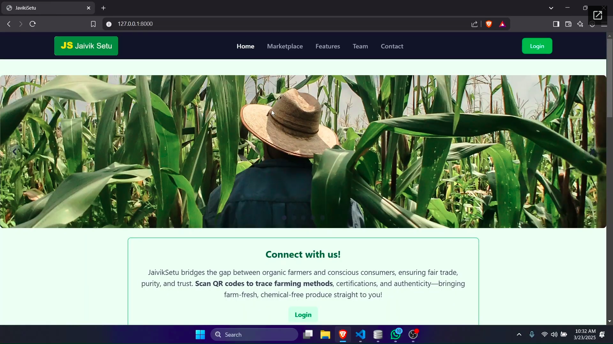

# Odoo X Gujarat Vidyapith Hackathon '25 Project

## Team Members

- Ansh Yadav
- Janvi Chauhan
- Tej Doshi
- Tirth Gohel

## Team Details

- **Team Name:** JaivikSetu
- **Team Number:** 36
- **Event:** Odoo X Gujarat Vidhyapith Hackathon '25

## Project Overview

This repository contains the project developed during the Odoo X Gujarat Vidhyapith Hackathon '25. Our team, JaivikSetu (Team No. 36), participated in this event to create an innovative solution leveraging Odoo’s capabilities. Below, you'll find details about our work and supporting materials.

## Supporting Documents

- **My Drive:** Access to project files and resources.
- **Additional Files:**
  - 📄 **[Project Documentation](https://github.com/aj045045/odoo-x-gujarat-vidyapith-hackathon-25/documents/JaivikSetu.docx)**
  - 📊 **[Presentation Slides](https://github.com/aj045045/odoo-x-gujarat-vidyapith-hackathon-25/documents/pitch-deck.pdf)**
  - 🌐 **[Sitemap](https://github.com/aj045045/odoo-x-gujarat-vidyapith-hackathon-25/documents/JaivikSetu-SiteMap.jpg)**
  - 🎥 **[Project Demo Video](https://drive.google.com/drive/folders/1duEsN3ovxoF7jXrB8GlXZ6mkhRknBwwH?usp=sharing)**
